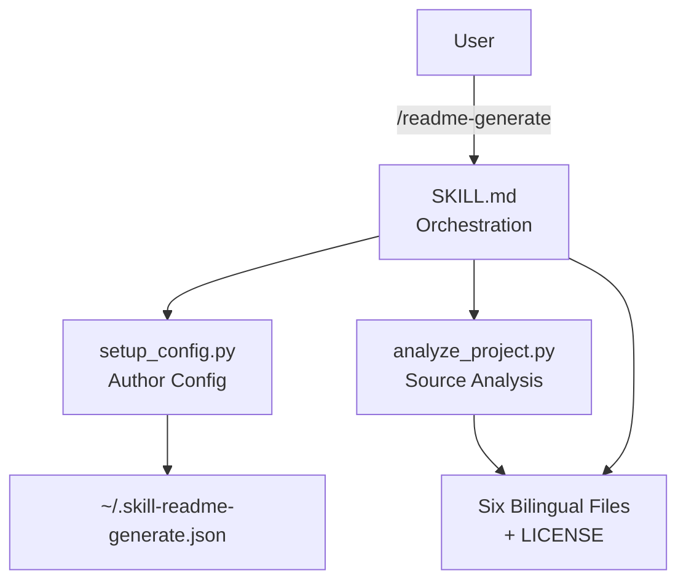

> [!NOTE]
> This README was generated by [SKILL](https://github.com/pardnchiu/skill-readme-generate), get the ZH version from [here](./doc/README.zh.md).

***

  <strong>BILINGUAL READMES AUTO-GENERATED FROM YOUR SOURCE!</strong>

***

> A Claude Code skill that generates six bilingual docs from source analysis, with private mode, seven licenses, and persistent author config

## Table of Contents

- [Features](#features)
- [Built With](#built-with)
- [Architecture](#architecture)
- [License](#license)

## Features

> Install to `~/.claude/skills/readme-generate/` · [Documentation](./doc/doc.md)

- **Six-File Bilingual Output** — One run produces README, doc, and architecture in both English and Traditional Chinese, authored in Chinese first to keep terminology consistent across translations.
- **Source-Code-Driven Analysis** — `analyze_project.py` parses exported types, function signatures, and dependencies for Python (AST), Go, JS, and TS; PHP and Swift are detected at file level only.
- **Three Orthogonal Parameters** — `private`, `LICENSE_TYPE`, and `REPO_PATH` compose freely in any order, defaulting to MIT when no license is specified.
- **Persistent Author Config** — `setup_config.py` maintains author, email, and GitHub identity in `~/.skill-readme-generate.json`, prompted once interactively then reused across runs.
- **Seven Built-In License Templates** — MIT, Apache-2.0, GPL-3.0, BSD-3-Clause, ISC, Unlicense, and Proprietary templates are embedded, with Proprietary implying private mode.

## Built With

## Architecture

> [Full Architecture](./doc/architecture.md)

## License

This project is licensed under the [MIT LICENSE](LICENSE).
