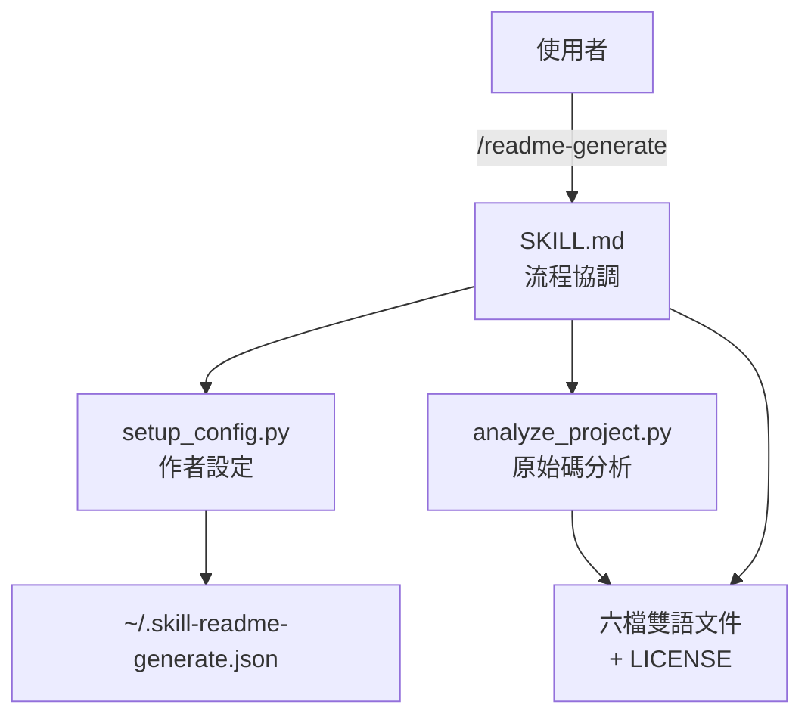

> [!NOTE]
> 此 README 由 [SKILL](https://github.com/pardnchiu/skill-readme-generate) 生成，英文版請參閱 [這裡](../README.md)。

***

  <strong>BILINGUAL READMES AUTO-GENERATED FROM YOUR SOURCE!</strong>

***

> Claude Code Skill，從原始碼分析產出六檔雙語文件，支援私有模式、七種授權與持久化作者設定

## 目錄

- [功能特點](#功能特點)
- [技術堆疊](#技術堆疊)
- [架構](#架構)
- [授權](#授權)

## 功能特點

> 部署至 `~/.claude/skills/readme-generate/` · [完整文件](./doc.zh.md)

- **六檔雙語輸出** — 單次執行產出 README、doc、architecture 各英中兩版，中文優先撰寫再翻譯以確保術語一致。
- **原始碼驅動分析** — `analyze_project.py` 對 Python（AST）/ Go / JS / TS 做完整解析（匯出型別、函式簽章、相依），PHP 與 Swift 僅做檔案層級偵測。
- **三個正交參數** — `private`、`LICENSE_TYPE`、`REPO_PATH` 順序無關且可自由組合，未指定授權時預設生成 MIT。
- **持久化作者設定** — `setup_config.py` 於 `~/.skill-readme-generate.json` 維護作者 / Email / GitHub，首次互動建立後無需重複輸入。
- **七種內嵌授權範本** — MIT、Apache-2.0、GPL-3.0、BSD-3-Clause、ISC、Unlicense、Proprietary 範本全內建，Proprietary 自動隱含私有模式。

## 技術堆疊

## 架構

> [完整架構](./architecture.zh.md)

## 授權

本專案採用 [MIT LICENSE](../LICENSE)。
