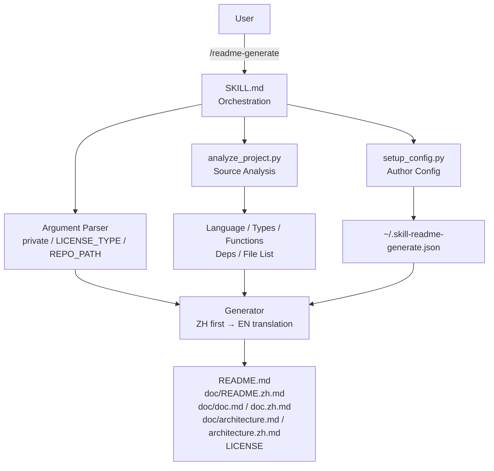
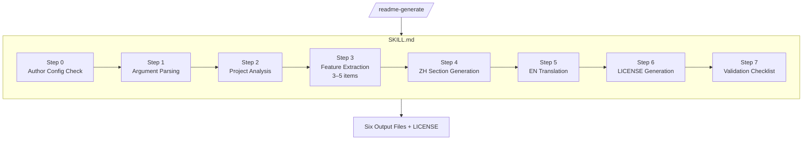
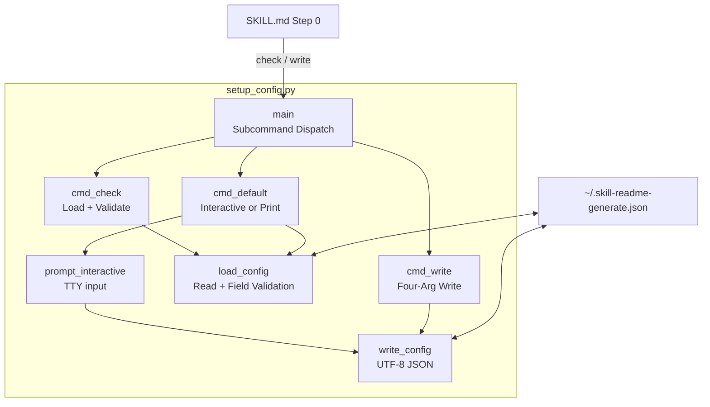
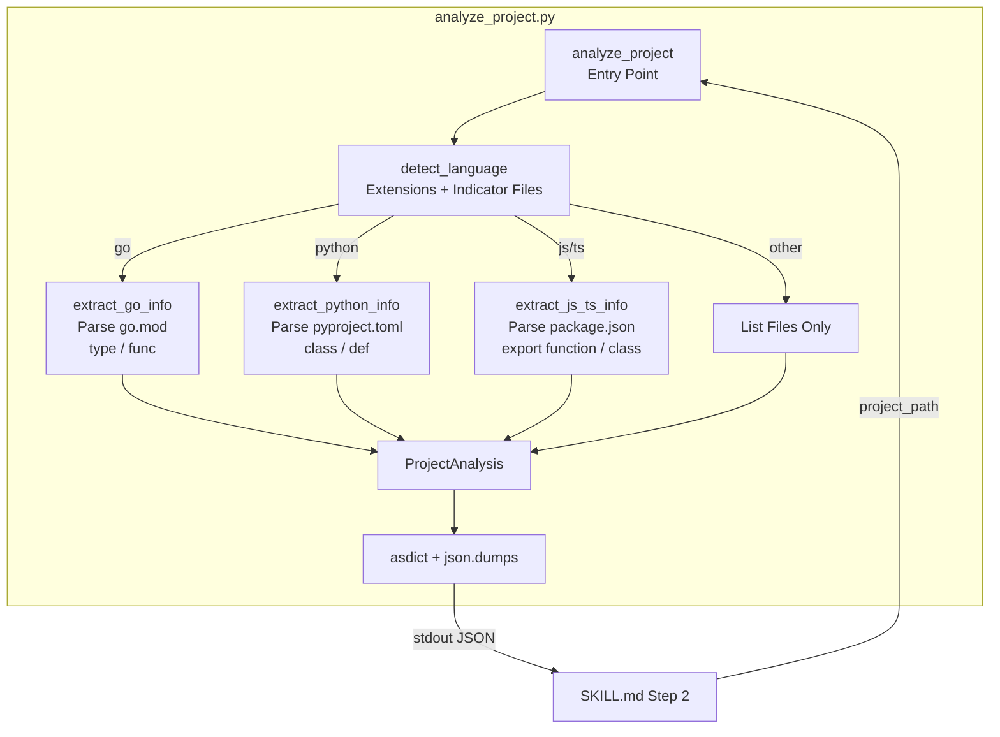
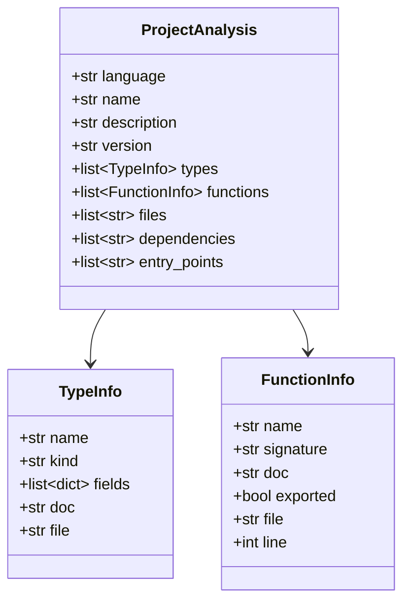
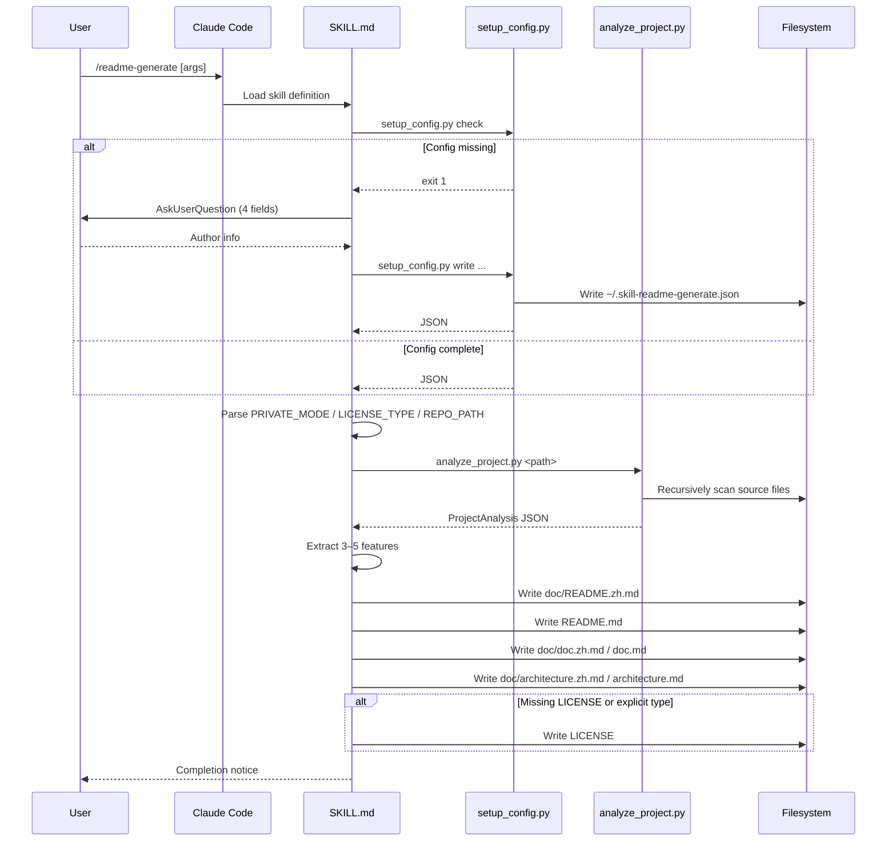
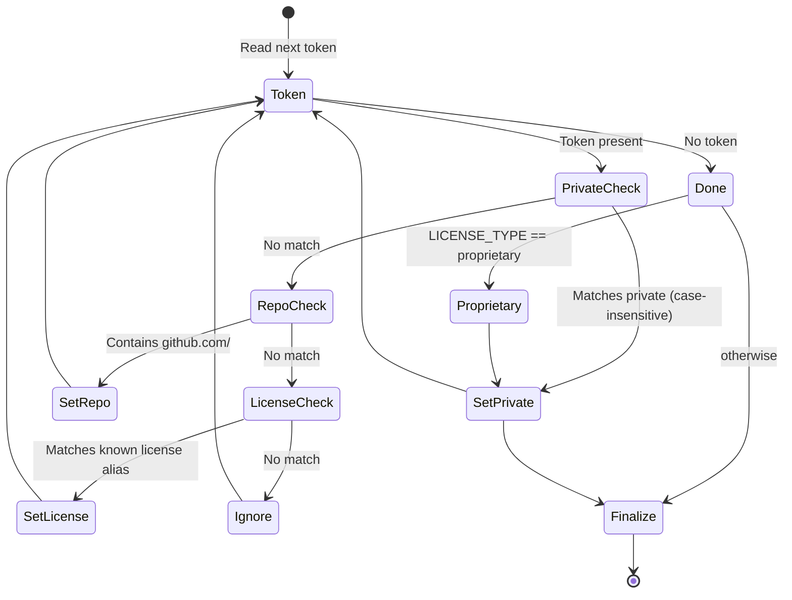

# readme-generate - Architecture

> Back to [README](../README.md)

## Overview

## Module: SKILL.md (Orchestration)

Defines the workflow, section ordering, and validation checklist that Claude must strictly follow when executing the skill. Contains no executable code — it constrains LLM behavior through prompt instructions.

## Module: setup_config.py (Author Config)

Provides three modes: interactive creation, non-interactive write, and existence check. The config is stored as JSON at `~/.skill-readme-generate.json` with all four fields required.

**Inputs / Outputs**:

| Subcommand | stdin | stdout | exit |
|------------|-------|--------|------|
| `check` | - | JSON or MISSING | 0 / 1 |
| `write` | - | JSON | 0 / 2 |
| default | TTY | JSON | 0 / 2 |

## Module: analyze_project.py (Source Analysis)

After auto-detecting the primary language, dispatches to the corresponding extractor to pull structural information. Output is a unified `ProjectAnalysis` dataclass serialized as JSON.

**Dataclasses**:

## Data Flow

Complete flow of a single `/readme-generate` invocation:

## Argument Parsing State Machine

Detection and classification of the three optional arguments:

