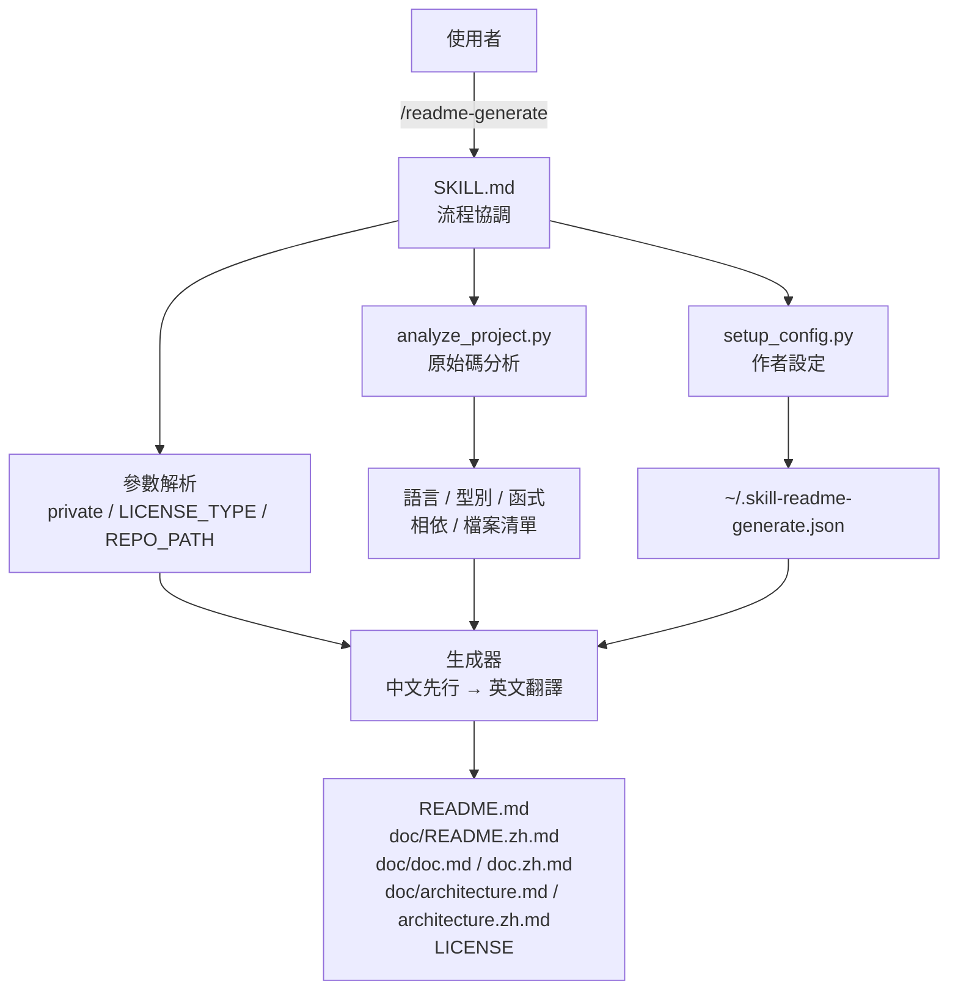
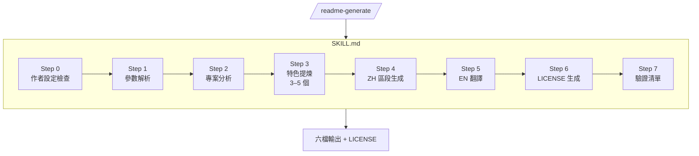
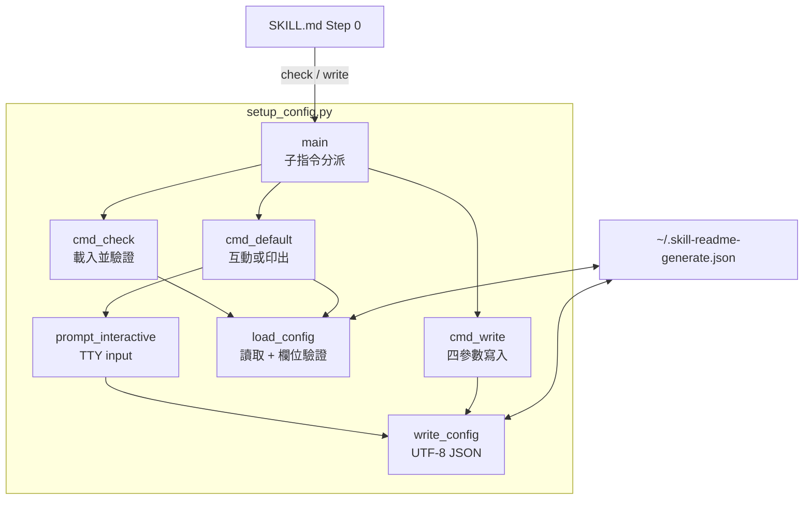
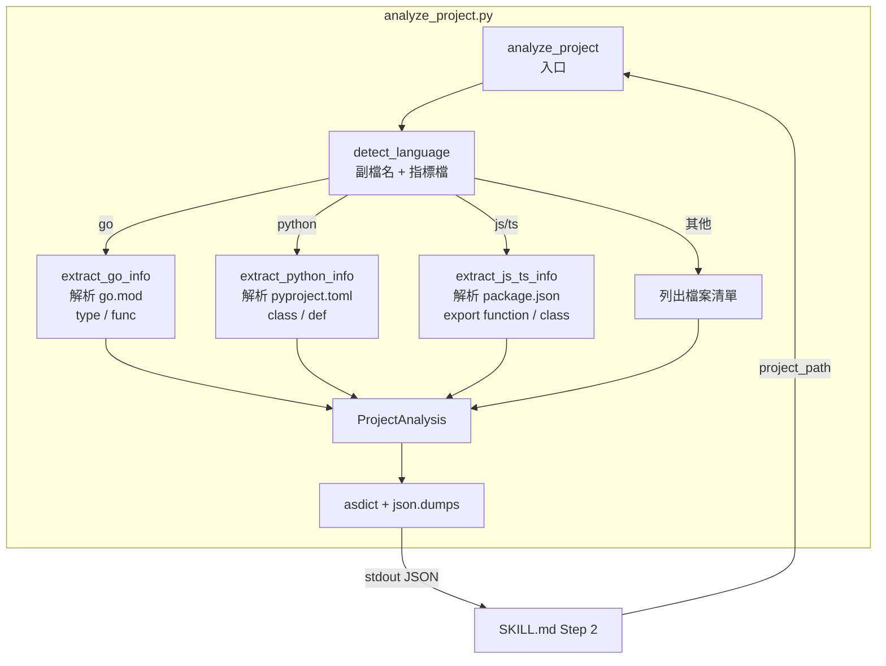
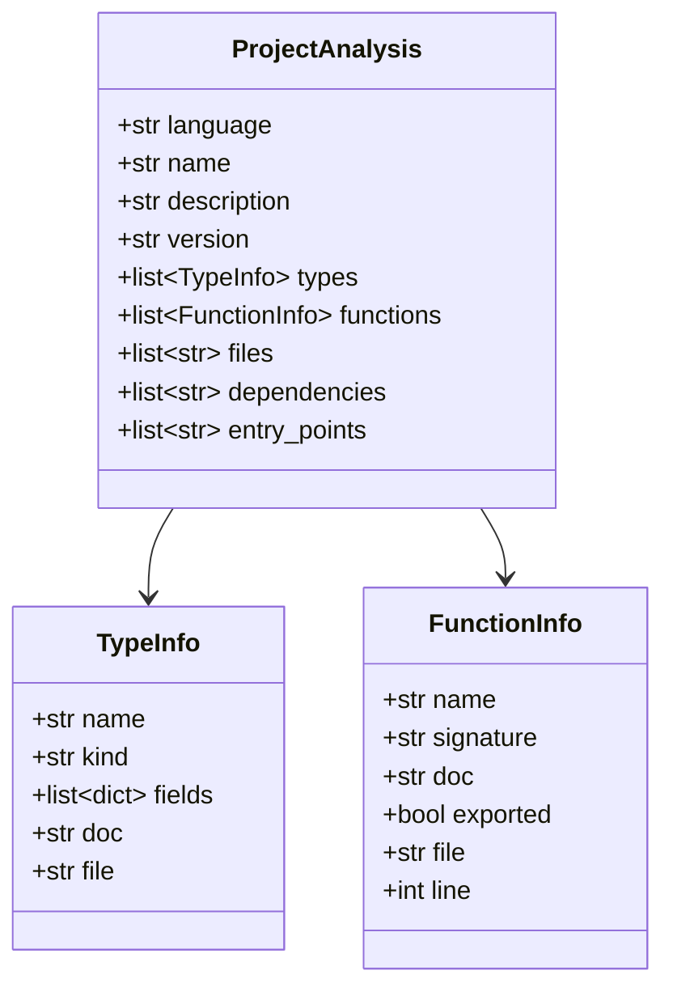
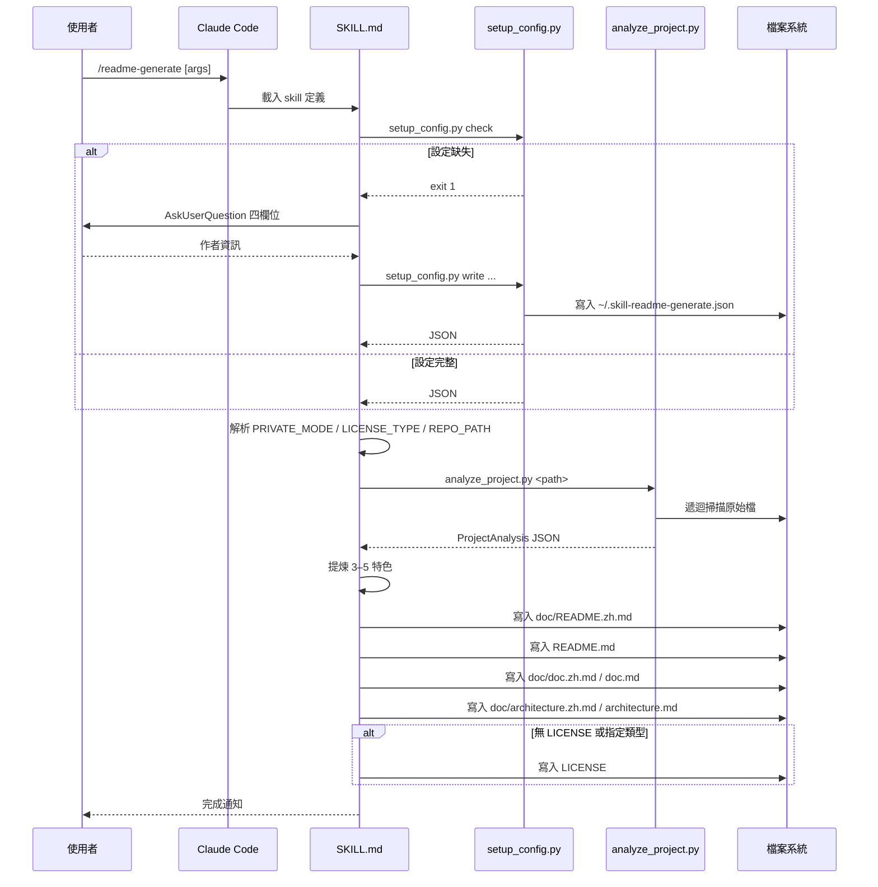
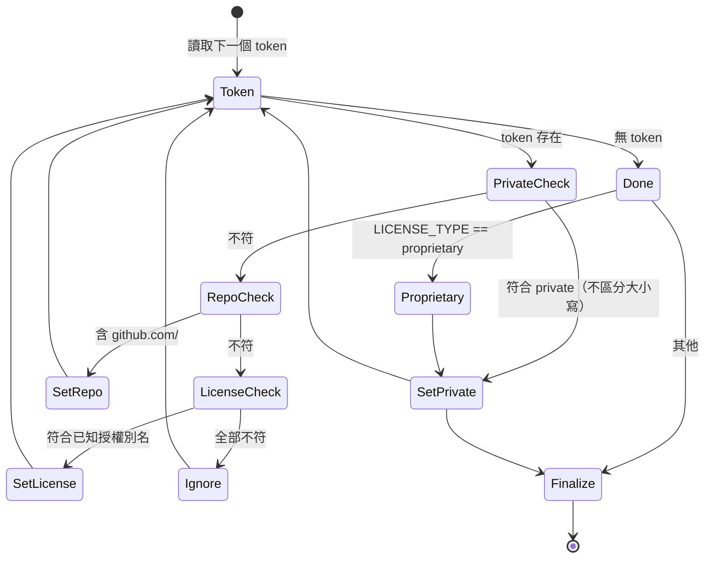

# readme-generate - 架構

> 返回 [README](./README.zh.md)

## 概覽

## Module: SKILL.md（流程協調）

定義 Claude 執行此 skill 時需嚴格遵守的工作流程、區段順序與驗證清單。本身不含執行碼，僅以提示詞約束 LLM 行為。

## Module: setup_config.py（作者設定）

提供三種模式：互動建立、非互動寫入、存在性檢查。設定以 JSON 格式存放於 `~/.skill-readme-generate.json`，四個欄位全部必填。

**輸入／輸出**：

| 子指令 | stdin | stdout | exit |
|--------|-------|--------|------|
| `check` | - | JSON 或 MISSING | 0 / 1 |
| `write` | - | JSON | 0 / 2 |
| 預設 | TTY | JSON | 0 / 2 |

## Module: analyze_project.py（原始碼分析）

自動偵測主要語言後，依語言別調用對應 extractor 提取結構資訊。輸出統一的 `ProjectAnalysis` 資料類別序列化為 JSON。

**資料類別**：

## 資料流

單次 `/readme-generate` 呼叫的完整流程：

## 參數解析狀態機

三個選填參數的偵測與分類：

