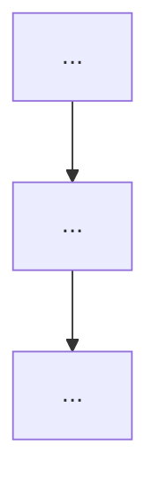

> [!NOTE]
> 此 README 由 [SKILL](https://github.com/pardnchiu/skill-readme-generate) 生成，英文版請參閱 [這裡](../README.md)。

***

<picture>

</picture>

  <strong>一句大寫英文標語！</strong>

***

> 一句話描述核心價值

## 目錄

- [功能特點](#功能特點)
- [技術堆疊](#技術堆疊)
- [架構](#架構)
- [授權](#授權)
- [Author](#author)
- [Stars](#stars)

## 功能特點

> `go install github.com/{owner}/{repo}/cmd/cli@latest` · [完整文件](./doc.zh.md)

- **特色 1 標題** — 一句話簡述。
- **特色 2 標題** — 一句話簡述。
- **特色 3 標題** — 一句話簡述。
- **特色 4 標題** — 一句話簡述。（可選）
- **特色 5 標題** — 一句話簡述。（可選）

## 技術堆疊

## 架構

> [完整架構](./architecture.zh.md)

## 授權

本專案採用 [MIT LICENSE](LICENSE)。

## Author

<h4 style="padding-top: 0">{author_name}</h4>

<a href="mailto:{author_email}">{author_email}</a> 
<a href="{author_url}">{author_url}</a>

## Stars

***

©️ {year} [{author_name}]({author_url})
